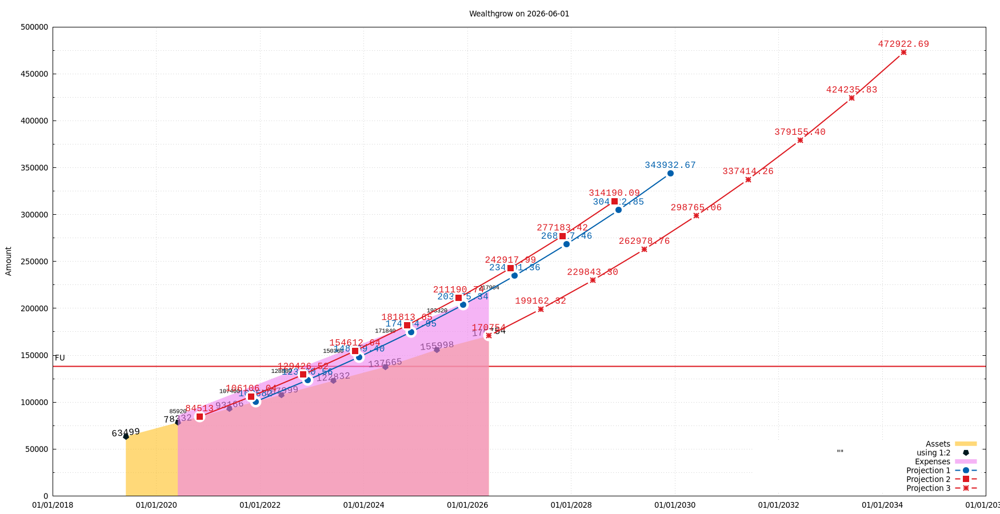
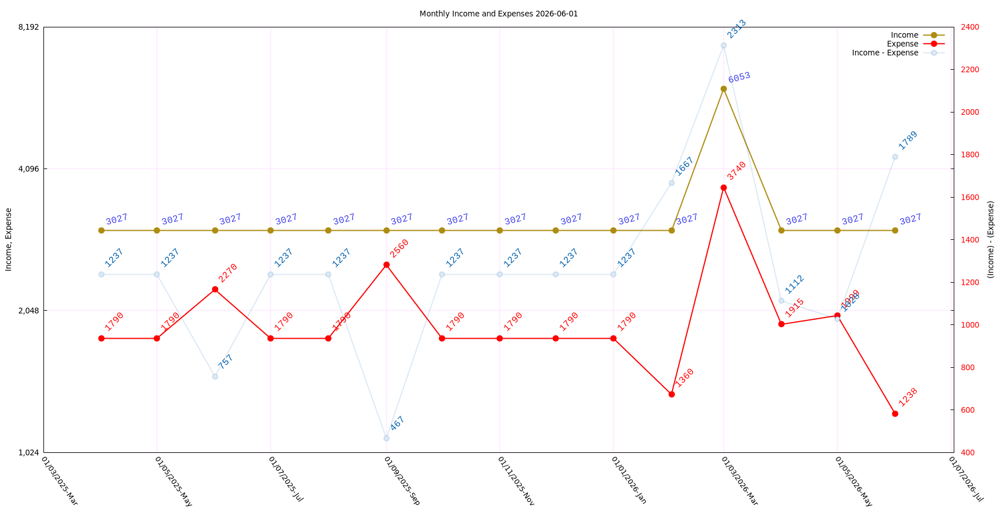
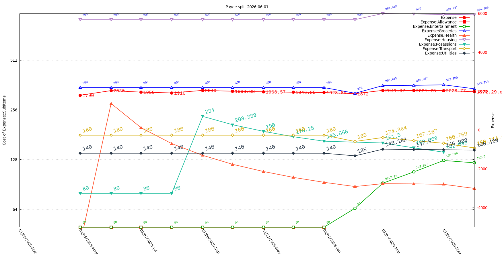
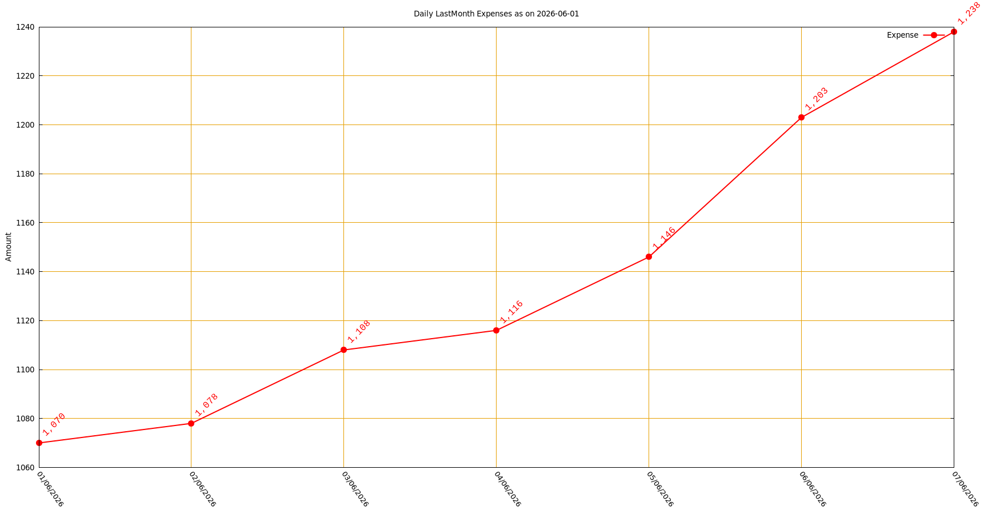
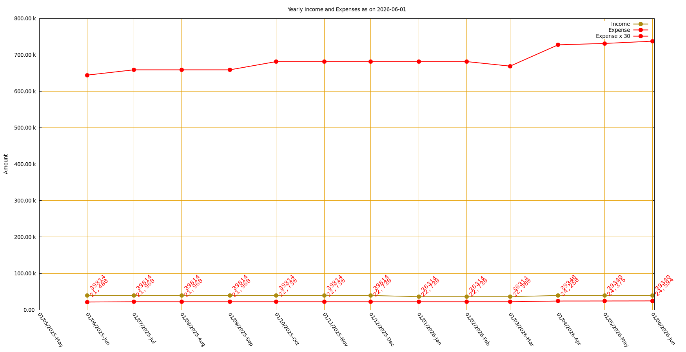

# ledger-graphs

Shell scripts that query [Ledger CLI](https://ledger-cli.org/) and render personal-finance graphs with [gnuplot](http://gnuplot.info/). Covers FIRE projections, income vs expense trends, expense sub-account breakdowns, and daily spending.

---

## Scripts

All scripts live in `v1/`. File-naming convention:

```
<index>-<point-interval>-<total-interval>-<title>.sh
```

| Script | Graph produced | Window |
|--------|---------------|--------|
| `1-yearly-last10year-cumulative_asset_expense.sh` | Cumulative assets & expenses + FIRE projections (`ledger_projection.png`) | Past ~10 years |
| `2-monthly-lastmonth-income_expense.sh` | Monthly income vs expense, with savings on a second axis (`graph2_monthly_inc_exp.png`) | Last 14 months |
| `3-monthly-lastmonth-expense_accounts.sh` | Expense sub-accounts with moving averages (`graph3_lastmonth.png`) | Last 13 months |
| `4-daily-lastmonth-expense.sh` | Daily expenses for the current/last month (`graph4_daily_lastmonth_expense.png`) | Last month |
| `5-monthly-last1year-income_expense.sh` | Rolling 12-month income & expense (`graph5_yearly_inc_exp.png`) | Last 12 months |

---

## Example graphs

> Generated from the synthetic 10-year test dataset included in `tests/`.

### Script 1 — Cumulative assets & FIRE projections



### Script 2 — Monthly income vs expense (14 months)



### Script 3 — Expense sub-accounts with moving averages (13 months)



### Script 4 — Daily expenses for the last month



### Script 5 — Rolling 12-month income & expense



`v1/lib.sh` is sourced by script 1 and provides shared functions: `ledger_b` (balance query), `net_yearly`, `projection`, and `get_past12_mothly_avg_savings`.

---

## Dependencies

| Tool | Purpose | Install |
|------|---------|---------|
| `ledger` | Queries the ledger journal | `sudo apt install ledger` |
| `gnuplot` | Renders PNG graphs | `sudo apt install gnuplot` |
| `dateutils` | `dateadd` / `dateseq` for date arithmetic | `sudo apt install dateutils` |
| `bc` | Floating-point arithmetic in projections | `sudo apt install bc` |
| `python3` | Savings calculation in script 2 | Usually pre-installed |

---

## Usage

### Script 1 — Cumulative assets, expenses & FIRE projections

```bash
bash v1/1-yearly-last10year-cumulative_asset_expense.sh \
  <YEARLY_EXPENSES_GBP> \
  <LEDGER_FILE> \
  <LEDGER_PRICE_DB> \
  <OUTPUT_FOLDER>
```

**Optional env vars:**

| Variable | Default | Purpose |
|----------|---------|---------|
| `YEARLY_EXPENSES_GBP` | `46000` | Annual spend used for FI target calculation |
| `PROJECTION_DATE1` | `2021-12` | Start date for projection line 1 |
| `PROJECTION_DATE2` | `2020-11` | Start date for projection line 2 |
| `LEDGER_RUN_DATE` | today | Date shown in graph title |

FIRE milestones drawn as horizontal reference lines:
- **FU** — 3× annual spend (career-flexibility buffer)
- **Lean FI** — 17× annual spend
- **Half FI** — 12× annual spend
- **FI** — 25× annual spend
- **Target** — 50× annual spend (2× FI)

### Script 2 — Monthly income vs expense (14 months)

```bash
bash v1/2-monthly-lastmonth-income_expense.sh \
  <LEDGER_FILE> \
  <LEDGER_PRICE_DB> \
  <OUTPUT_FOLDER>
```

Produces `graph2_monthly_inc_exp.png`. Income and expense on a log-scale left axis; net savings on a linear right axis.

### Script 3 — Expense sub-accounts with moving averages (13 months)

```bash
bash v1/3-monthly-lastmonth-expense_accounts.sh \
  <LEDGER_FILE> \
  <LEDGER_PRICE_DB> \
  <OUTPUT_FOLDER>
```

Produces `graph3_lastmonth.png`. Tracks: Allowance, Entertainment, Groceries, Health, Housing, Posessions, Transport, Utilities — each as a cumulative moving average line.

### Script 4 — Daily expenses for the last month

```bash
bash v1/4-daily-lastmonth-expense.sh \
  <LEDGER_FILE> \
  <OUTPUT_FOLDER>
```

Produces `graph4_daily_lastmonth_expense.png`. Uses the most recent transaction date to determine the month boundary.

### Script 5 — Rolling 12-month income & expense

```bash
bash v1/5-monthly-last1year-income_expense.sh \
  <LEDGER_FILE> \
  <LEDGER_PRICE_DB> \
  <OUTPUT_FOLDER>
```

Produces `graph5_yearly_inc_exp.png`. Each data point is the sum over the preceding 12 months, giving a smoothed rolling view.

---

## Environment variables

| Variable | Used by | Purpose |
|----------|---------|---------|
| `LEDGER_FILE` | all | Path to the ledger journal file |
| `LEDGER_PRICE_DB` | 1, 2, 3, 5 | Path to the price database |
| `LEDGER_TEST_DATE` | all | Pin "today" for deterministic output (testing) |
| `LEDGER_TERM` | all | gnuplot terminal string (default: `pngcairo`) |

All scripts use `${LEDGER_TEST_DATE:-$(date +"%Y-%m-%d")}` so that setting this variable makes every output file byte-for-byte reproducible — essential for the test suite.

---

## Tests

```bash
# Run tests (compare data files against golden snapshots)
bash tests/run_tests.sh

# Regenerate golden files after an intentional change
bash tests/create_golden.sh
```

The test suite runs all five scripts against `tests/test.ledger` (10 years of synthetic GBP data with multi-currency entries) and diffs the intermediate `.tmp`/`.txt` data files against committed golden files in `tests/golden/script{1..5}/`. PNGs are checked for existence only. 74 assertions total.

See `tests/CLAUDE.md` for full design notes, known gaps, and the test data schema.
